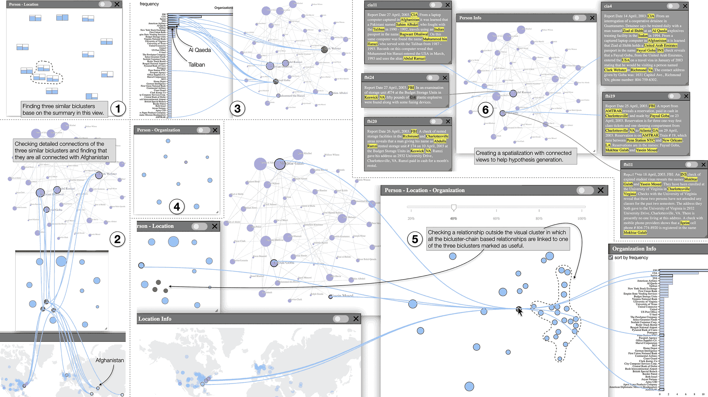

## SightBi: Exploring Cross-View Data Relationships with Biclusters

### Overview
**SightBi** is a visual analytics tool designed to explore **cross-view data relationships** in multiple-view (MV) visualization environments. It enables users to uncover hidden data connections across different views using **biclusters**, offering an intuitive and efficient alternative to traditional view-coordination techniques like brushing and linking.

By introducing **relationship-views**, SightBi enhances **sensemaking** across domains such as **bioinformatics, cybersecurity, and text analytics**, allowing users to visually navigate complex datasets with minimal trial-and-error.

## 📸 App Screenshot


### Features
- **Bicluster-Based Relationship Discovery**: Automatically computes cross-view relationships using **biclustering techniques**.
- **Interactive Visualization**: Supports flexible layout organization with dynamic view adjustments.
- **Relationship-Views**: Introduces standalone **relationship-views** to help preserve the integrity of existing visualizations.
- **Multi-Level Exploration**: Enables users to **filter, refocus, and connect** data across different views.
- **Customizable Interactions**: Supports **dragging, linking, pinning, and marking** relationships for efficient exploration.

### Installation
#### Prerequisites
Ensure you have the following dependencies installed:
- Node.js (>= 14.x)
- Required Node.js packages:
  ```bash
  npm install express ejs body-parser fs path html-to-image jsdom xml-reader xml-query read-xml node-geocoder objects-to-csv
  ```
- D3.js and related visualization libraries

#### Cloning the Repository
Clone the SightBi repository from GitHub:
```bash
git clone https://github.com/sabdulrahman/SightBi.git
cd SightBi
```

#### Running SightBi
To launch SightBi, run:
```bash
node index.js
```
Then, open your browser and navigate to:
```
http://localhost:3000
```

### Usage
1. **Load Your Dataset**: Import data containing multiple views (e.g., networks, spatial data, text, etc.).
2. **Compute Cross-View Relationships**: Use SightBi’s biclustering algorithms to automatically identify related subsets.
3. **Explore Relationship-Views**: Interactively navigate detected relationships between views.
4. **Adjust Layouts**: Drag and reposition views for better analysis.
5. **Save & Export Findings**: Export visualizations for reports and presentations.

### Example Use Case
A security analyst using **SightBi** can:
- Load intelligence reports and visualize networks of entities (e.g., **people, locations, organizations**).
- Automatically detect **collusions** among suspicious individuals.
- Visually track **connections** between suspects and locations without manually inspecting individual records.
- Generate **interactive reports** with the findings.

### Citation
For more details, refer to the paper: [SightBi: Exploring Cross-View Data Relationships with Biclusters](https://dl.acm.org/doi/abs/10.1109/TVCG.2021.3114801)


If you use **SightBi** in your research, please cite:
```
@article{sun2021sightbi,
  author    = {Maoyuan Sun and Abdul Rahman Shaikh and Hamed Alhoori and Jian Zhao},
  title     = {SightBi: Exploring Cross-View Data Relationships with Biclusters},
  journal   = {IEEE Transactions on Visualization and Computer Graphics},
  year      = {2021}
}
```